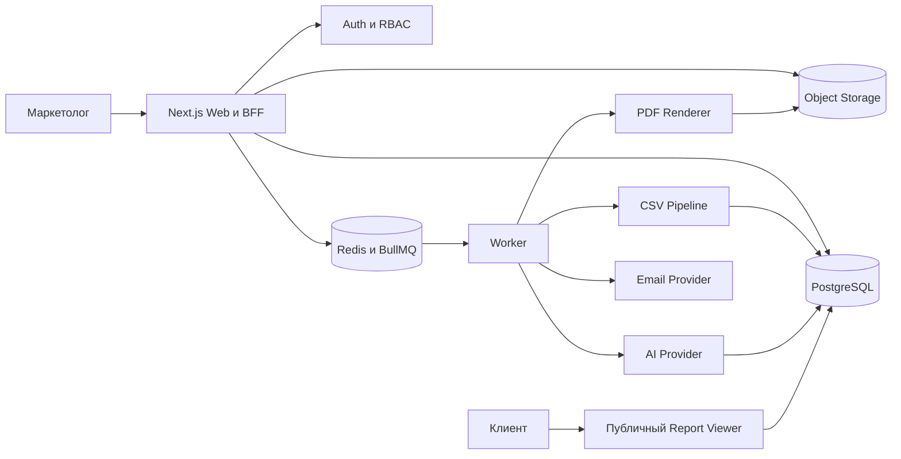

# MAG — подробный план продукта и разработки

Версия документа: 1.0
Целевой рынок первого релиза: Россия и СНГ
Язык продукта: русский, с технической готовностью к локализации
Статус: pre-development

## 1. Краткое описание

MAG — SaaS для небольших маркетинговых агентств и маркетологов-фрилансеров. Сервис превращает выгрузки рекламных и аналитических систем в понятные брендированные отчёты для клиентов.

Первый пользовательский сценарий:

1. Маркетолог регистрируется и создаёт агентство.
2. Добавляет клиента и фирменный стиль.
3. Загружает CSV за текущий и предыдущий периоды.
4. Сопоставляет колонки с каноническими метриками MAG.
5. Получает рассчитанные KPI, сравнения и графики.
6. Генерирует AI-комментарии на основе рассчитанных фактов.
7. Проверяет и редактирует выводы.
8. Публикует неизменяемую версию отчёта.
9. Отправляет клиенту защищённую ссылку или PDF.

Главное обещание продукта: сократить подготовку ежемесячного клиентского отчёта с нескольких часов до 10–20 минут без потери контроля над цифрами и формулировками.

## 2. Целевая аудитория

### 2.1. Основной сегмент

- агентства размером 2–20 сотрудников;
- фрилансеры с 5–30 активными клиентами;
- команды, которые ежемесячно собирают отчёты вручную;
- пользователи Яндекс Директа, Яндекс Метрики, VK Ads, рекламных кабинетов и CRM;
- команды без собственного BI-разработчика.

### 2.2. Роли

#### Владелец агентства

- создаёт рабочее пространство;
- управляет участниками, тарифом и брендингом;
- видит всех клиентов и отчёты;
- управляет лимитами и публикациями.

#### Маркетолог

- создаёт клиентов;
- импортирует данные;
- готовит, проверяет и публикует отчёты;
- отправляет отчёты клиентам.

#### Клиент

В MVP не имеет полноценного аккаунта. Открывает опубликованный отчёт по защищённой ссылке. Позднее получает портал, историю отчётов и комментарии.

### 2.3. Jobs To Be Done

- «Когда заканчивается отчётный период, я хочу быстро собрать данные в одном месте, чтобы не переносить цифры вручную».
- «Я хочу автоматически увидеть существенные изменения, чтобы сосредоточиться на выводах».
- «Я хочу объяснить результаты простым языком, чтобы клиент понял ценность работы агентства».
- «Я хочу отправить профессиональный отчёт под своим брендом, чтобы укрепить доверие».
- «Я хочу повторять процесс ежемесячно без повторной настройки колонок».

## 3. Проверяемые продуктовые гипотезы

1. Пользователь способен подготовить первый отчёт по шаблонному CSV максимум за 10 минут.
2. Повторный отчёт с сохранённым сопоставлением колонок занимает максимум 5 минут до этапа проверки.
3. Не менее 70% AI-комментариев требуют только небольшой редакторской правки.
4. Агентство публикует не менее трёх отчётов в течение первого месяца.
5. Экономия минимум двух часов в месяц оправдывает подписку от 3 990 рублей.
6. Веб-ссылка используется чаще PDF после того, как клиент видит оба варианта.

До расширения MVP нужно провести не менее пяти интервью и получить обезличенные образцы реальных CSV и отчётов.

## 4. Границы MVP

### 4.1. Обязательно

- регистрация и вход;
- рабочее пространство агентства;
- роли владельца и участника;
- список клиентов;
- бренд агентства и опциональный бренд клиента;
- загрузка CSV;
- предпросмотр и сопоставление колонок;
- валидация и нормализация данных;
- сохранение схемы сопоставления;
- текущий и предыдущий периоды;
- базовые KPI и автоматические сравнения;
- фиксированный шаблон отчёта;
- AI-резюме, достижения, риски, гипотезы и следующие действия;
- ручное редактирование AI-текста;
- публикация неизменяемого snapshot;
- защищённая клиентская ссылка;
- отзыв ссылки и срок действия;
- PDF на основе опубликованного snapshot;
- ручная отправка email;
- аудит ключевых действий;
- базовые лимиты использования.

### 4.2. Не входит

- прямые OAuth/API-интеграции;
- свободный drag-and-drop конструктор;
- собственная модель атрибуции;
- кросс-канальная дедупликация конверсий;
- мобильное приложение;
- комментарии клиента;
- white-label домены;
- автоматическая ежемесячная отправка;
- полноценный биллинг и автоматические списания;
- произвольные формулы KPI;
- импорт Excel и Google Sheets;
- английский интерфейс.

Эти ограничения защищают MVP от превращения в BI-платформу до проверки спроса.

## 5. Метрики успеха

### 5.1. Активация

- регистрация → создан первый клиент;
- создан клиент → начата загрузка;
- загрузка → успешно нормализованы данные;
- данные → опубликован первый отчёт;
- медианное время до первого опубликованного отчёта.

### 5.2. Ценность

- время подготовки первого и повторного отчёта;
- доля отредактированных AI-секций;
- средний объём ручной правки;
- число опубликованных отчётов на агентство;
- доля просмотренных клиентами ссылок;
- доля скачанных PDF.

### 5.3. Удержание и коммерция

- агентства, вернувшиеся в следующий отчётный период;
- клиенты с отчётами в два последовательных месяца;
- переход с beta на платный тариф;
- стоимость AI и инфраструктуры на один отчёт;
- валовая маржа по тарифу.

## 6. UX и информационная архитектура

### 6.1. Основная навигация

- Обзор;
- Клиенты;
- Отчёты;
- Импорты;
- Настройки агентства;
- Команда;
- Использование и тариф.

### 6.2. Основные экраны

#### Регистрация и onboarding

- email;
- подтверждение email;
- название агентства;
- логотип и основной цвет;
- создание первого клиента;
- предложение скачать шаблон CSV.

#### Клиенты

- поиск и фильтры;
- статус последнего отчёта;
- дата последней активности;
- быстрые действия: загрузить данные, создать отчёт, открыть историю.

#### Мастер импорта

1. Выбор клиента и источника.
2. Загрузка файла.
3. Выбор кодировки, разделителя и строки заголовков при необходимости.
4. Предпросмотр первых строк.
5. Автоматическое предположение сопоставления.
6. Ручная корректировка.
7. Валидация дат, чисел, валюты и обязательных колонок.
8. Подтверждение периода.
9. Фоновая обработка.
10. Результат с количеством принятых и отклонённых строк.

#### Редактор отчёта

- заголовок и период;
- KPI-карточки;
- график динамики;
- разбивка по каналам и кампаниям;
- AI-резюме;
- достижения;
- риски;
- гипотезы;
- следующие действия;
- методология и источники;
- переключение «редактирование / клиентский просмотр»;
- действия «сохранить», «перегенерировать секцию», «опубликовать».

#### Публичный отчёт

- логотип и цвета;
- период и дата публикации;
- адаптивные графики;
- понятные выводы;
- время последнего snapshot;
- скачивание PDF, если разрешено;
- PIN-форма, если включена защита.

### 6.3. Критические состояния интерфейса

- пустой аккаунт;
- первая загрузка;
- повреждённый CSV;
- неверная кодировка;
- неизвестные колонки;
- смешанные валюты;
- отсутствующий предыдущий период;
- частично обработанный файл;
- повторная загрузка того же файла;
- AI временно недоступен;
- PDF ещё создаётся;
- ссылка истекла или отозвана;
- превышен лимит тарифа.

## 7. Дизайн-система

### 7.1. Принципы

- интерфейс должен быть понятен маркетологу без обучения;
- визуальный акцент — на изменениях KPI и выводах;
- отчёт выглядит профессионально без ручной настройки;
- редактирование отделено от клиентского просмотра;
- цвет не является единственным способом показать рост или падение;
- все ключевые действия доступны с клавиатуры;
- печатная версия повторяет опубликованный веб-отчёт.

### 7.2. Базовые компоненты

- AppShell;
- Sidebar;
- PageHeader;
- ClientCard;
- MetricCard;
- DeltaBadge;
- DateRangePicker;
- UploadDropzone;
- CsvPreview;
- ColumnMapper;
- ImportProgress;
- ChartCard;
- NarrativeEditor;
- ReportSection;
- BrandPreview;
- PublishDialog;
- ShareLinkPanel;
- UsageMeter;
- EmptyState;
- ErrorState.

### 7.3. Процесс дизайна

1. Low-fidelity wireframes ключевого сценария.
2. Кликабельный прототип.
3. Пять модерируемых тестов.
4. Корректировка терминологии и последовательности.
5. UI kit и дизайн-токены.
6. Desktop-first макеты.
7. Адаптация публичного отчёта для мобильных устройств.
8. Print/PDF макет.
9. Проверка WCAG AA для ключевых сценариев.

## 8. Технологический стек

### 8.1. Репозиторий

- pnpm workspaces;
- Turborepo;
- TypeScript в strict mode;
- Node.js Active LTS;
- ESLint;
- Prettier;
- EditorConfig;
- Husky и lint-staged после появления первого приложения;
- Changesets только при необходимости публиковать пакеты.

### 8.2. Web и BFF

- Next.js на актуальной стабильной версии;
- React;
- Server Components для чтения;
- Server Actions или Route Handlers для команд;
- Tailwind CSS;
- shadcn/ui;
- React Hook Form;
- Zod;
- Recharts;
- TanStack Table только для сложных таблиц.

### 8.3. Backend

Первый релиз — модульный монолит. UI, HTTP-слой и бизнес-логика находятся в одном репозитории, но бизнес-правила вынесены в отдельные packages.

- PostgreSQL;
- Drizzle ORM;
- Redis;
- BullMQ;
- S3-совместимое Object Storage;
- Playwright для PDF;
- React Email;
- SMTP/Unisender для email.

### 8.4. AI

- внутренний интерфейс `AiProvider`;
- YandexGPT или GigaChat как первый российский провайдер;
- OpenAI-compatible adapter для переносимости;
- JSON Schema для структурированного ответа;
- versioned prompts;
- Zod-валидация;
- ограниченные retry;
- учёт токенов, времени и стоимости;
- deterministic fallback без AI.

### 8.5. Развёртывание

- Docker для web и worker;
- managed PostgreSQL;
- managed Redis;
- Object Storage;
- Yandex Cloud или Selectel;
- GitHub Actions;
- отдельные staging и production окружения;
- секреты только в secret manager/CI variables.

## 9. Структура monorepo

```text
MAG/
├── apps/
│   ├── web/
│   └── worker/
├── packages/
│   ├── ai/
│   ├── config/
│   ├── csv/
│   ├── db/
│   ├── domain/
│   ├── email/
│   ├── observability/
│   └── ui/
├── docs/
│   ├── PROJECT_PLAN.md
│   ├── adr/
│   ├── api/
│   └── runbooks/
├── infra/
├── fixtures/
├── .github/
│   └── workflows/
├── compose.yaml
├── package.json
├── pnpm-workspace.yaml
└── turbo.json
```

## 10. Архитектура



### 10.1. Архитектурные правила

1. UI не обращается к ORM напрямую.
2. Route Handler вызывает application service.
3. Application service проверяет actor, agency и разрешение.
4. Repository требует `agencyId` для tenant-scoped сущностей.
5. Job содержит идентификаторы, но не большие payload и не секреты.
6. Повторное выполнение job безопасно.
7. Публикация создаёт immutable snapshot.
8. Публичная страница читает только snapshot.
9. AI не рассчитывает KPI.
10. Исходные данные не передаются AI без необходимости.

### 10.2. Границы модулей

#### Identity

- пользователи;
- сессии;
- подтверждение email;
- восстановление доступа.

#### Agencies

- рабочие пространства;
- участники;
- роли;
- брендинг.

#### Clients

- карточки клиентов;
- настройки валюты и timezone;
- история активности.

#### Imports

- загрузки;
- mappings;
- валидация;
- normalizing;
- import errors.

#### Analytics

- канонические метрики;
- агрегирование;
- сравнение периодов;
- derived KPI.

#### Reports

- draft;
- секции;
- snapshot;
- публикация;
- публичный просмотр.

#### Narratives

- prompts;
- AI generation;
- validation;
- ручная редактура.

#### Delivery

- share links;
- PDF;
- email;
- delivery events.

#### Billing

- планы;
- квоты;
- usage;
- позднее ЮKassa.

## 11. Модель данных

Все tenant-scoped таблицы содержат `agency_id`. Доступ к ним осуществляется только через repositories, принимающие контекст текущего агентства.

### 11.1. Identity и tenancy

#### users

- id;
- email;
- name;
- email_verified_at;
- created_at;
- updated_at.

#### agencies

- id;
- name;
- slug;
- default_currency;
- timezone;
- created_at;
- updated_at;
- deleted_at.

#### memberships

- user_id;
- agency_id;
- role: owner/member;
- status;
- created_at.

### 11.2. Клиенты и брендинг

#### clients

- id;
- agency_id;
- name;
- slug;
- currency;
- timezone;
- status;
- created_at;
- updated_at;
- deleted_at.

#### brand_themes

- id;
- agency_id;
- client_id nullable;
- logo_object_key;
- primary_color;
- secondary_color;
- font_preset;
- footer_text.

### 11.3. Импорты

#### imports

- id;
- agency_id;
- client_id;
- source_type;
- object_key;
- original_filename;
- checksum;
- status;
- row_count;
- accepted_count;
- rejected_count;
- period_start;
- period_end;
- created_by;
- created_at;
- completed_at.

#### column_mappings

- id;
- agency_id;
- client_id;
- source_type;
- name;
- mapping_json;
- delimiter;
- encoding;
- header_row;
- created_at;
- updated_at.

#### import_errors

- id;
- agency_id;
- import_id;
- row_number;
- column_name;
- error_code;
- safe_message;
- raw_value_masked.

#### metric_values

- id;
- agency_id;
- client_id;
- import_id;
- occurred_on;
- source;
- channel;
- campaign_external_id;
- campaign_name;
- metric_key;
- metric_value_decimal;
- currency;
- dimensions_json.

Для денежных значений использовать decimal или minor units. Float запрещён.

### 11.4. Отчёты

#### reports

- id;
- agency_id;
- client_id;
- title;
- current_period_start;
- current_period_end;
- comparison_period_start;
- comparison_period_end;
- status: draft/processing/review/published/archived;
- created_by;
- created_at;
- updated_at.

#### report_sections

- id;
- agency_id;
- report_id;
- section_type;
- position;
- configuration_json;
- content_json;
- updated_at.

#### ai_narratives

- id;
- agency_id;
- report_id;
- section_type;
- facts_json;
- prompt_version;
- provider;
- model;
- generated_text;
- edited_text;
- validation_status;
- token_usage;
- latency_ms;
- created_at.

#### report_snapshots

- id;
- agency_id;
- report_id;
- version;
- snapshot_json;
- published_by;
- published_at.

Snapshot содержит только данные, необходимые для отображения, и не зависит от последующих изменений draft.

### 11.5. Доставка и аудит

#### share_links

- id;
- agency_id;
- snapshot_id;
- token_hash;
- pin_hash nullable;
- expires_at nullable;
- revoked_at nullable;
- allow_pdf;
- created_at.

#### deliveries

- id;
- agency_id;
- snapshot_id;
- recipient_email;
- channel;
- provider_message_id;
- status;
- sent_at;
- opened_at nullable;
- error_code nullable.

#### audit_events

- id;
- agency_id;
- actor_user_id nullable;
- action;
- entity_type;
- entity_id;
- metadata_json;
- ip_hash nullable;
- created_at.

### 11.6. Тарифы

#### subscriptions

- id;
- agency_id;
- plan_code;
- status;
- provider;
- provider_subscription_id;
- period_start;
- period_end.

#### usage_counters

- agency_id;
- metric;
- period_key;
- value;
- updated_at.

## 12. CSV-контракт

### 12.1. Канонические измерения

- `date`;
- `source`;
- `channel`;
- `campaign_id`;
- `campaign_name`;
- `ad_group`;
- `creative`;
- `device`;
- `region`.

### 12.2. Канонические базовые метрики

- impressions;
- clicks;
- spend;
- conversions;
- revenue;
- sessions;
- users;
- leads;
- orders.

### 12.3. Производные KPI

- CTR = clicks / impressions;
- CPC = spend / clicks;
- CPM = spend / impressions × 1000;
- CVR = conversions / clicks или sessions, согласно источнику;
- CPA = spend / conversions;
- ROAS = revenue / spend;
- CPL = spend / leads;
- AOV = revenue / orders.

Знаменатель и методология каждого KPI фиксируются в отчёте. Нулевые знаменатели возвращают `null`, а не бесконечность или ноль.

### 12.4. Правила импорта

- максимальный размер MVP определяется нагрузочным тестом, начальный лимит — 25 МБ;
- обработка streaming, без загрузки файла целиком в память;
- поддержка UTF-8 и Windows-1251;
- автоматическое определение запятой, точки с запятой и табуляции;
- даты приводятся к timezone клиента;
- разделители decimal нормализуются;
- формулы CSV не исполняются;
- исходное значение для ошибок маскируется;
- checksum предотвращает случайный повторный импорт;
- повторный job не создаёт дубликаты;
- частичный импорт либо атомарен, либо явно помечен и восстанавливаем.

## 13. Расчёты и сравнение периодов

### 13.1. Правила

- сравнивать равные по длине периоды по умолчанию;
- предупреждать о неполном текущем периоде;
- хранить границы периода включительно в timezone клиента;
- абсолютная дельта = current − previous;
- процентная дельта = delta / abs(previous) × 100;
- при previous = 0 процентную дельту не показывать;
- направленность метрики задаётся отдельно: рост CPA может быть негативным;
- существенность учитывает абсолютный порог и процент;
- округление происходит только в presentation layer.

### 13.2. Проверки

- сумма по дням совпадает с итогом;
- derived KPI считается из агрегированных числителя и знаменателя;
- смешанные валюты не агрегируются;
- отсутствующие данные отличаются от нуля;
- timezone не сдвигает дату;
- одинаковый input даёт одинаковый output.

## 14. AI-комментарии

### 14.1. Принцип

AI объясняет факты, рассчитанные системой. AI не является источником цифр и не должен самостоятельно вычислять KPI по сырым данным.

### 14.2. Вход

- период;
- предыдущий период;
- агрегированные KPI;
- значимые изменения;
- top channels/campaigns;
- методология;
- допустимый tone of voice;
- запрещённые утверждения.

Названия клиента и кампаний передаются только при включённой настройке и необходимости.

### 14.3. Структурированный выход

```json
{
  "summary": "string",
  "wins": ["string"],
  "risks": ["string"],
  "hypotheses": ["string"],
  "nextActions": ["string"],
  "referencedFacts": [
    {
      "metric": "string",
      "current": 0,
      "previous": 0
    }
  ]
}
```

### 14.4. Guardrails

- JSON Schema и Zod validation;
- проверка всех чисел по facts;
- запрет причинных утверждений без данных;
- неподтверждённые причины называются гипотезами;
- ограниченная длина;
- максимум две повторные попытки;
- fallback на deterministic summary;
- обязательный ручной review перед первой публикацией;
- версия prompt и модели сохраняется;
- sensitive data не попадает в application logs.

## 15. API и application commands

Точные URL могут измениться, но границы use cases фиксируются заранее.

### 15.1. Agency и clients

- `POST /api/agencies`;
- `GET /api/clients`;
- `POST /api/clients`;
- `GET /api/clients/:clientId`;
- `PATCH /api/clients/:clientId`;
- `DELETE /api/clients/:clientId`;
- `PUT /api/brand-theme`.

### 15.2. Imports

- `POST /api/imports/presign`;
- `POST /api/imports`;
- `GET /api/imports/:importId/preview`;
- `PUT /api/imports/:importId/mapping`;
- `POST /api/imports/:importId/process`;
- `GET /api/imports/:importId`;
- `GET /api/imports/:importId/errors`;

### 15.3. Reports

- `POST /api/reports`;
- `GET /api/reports/:reportId`;
- `PATCH /api/reports/:reportId`;
- `POST /api/reports/:reportId/generate-narrative`;
- `PATCH /api/reports/:reportId/sections/:sectionId`;
- `POST /api/reports/:reportId/publish`;
- `POST /api/reports/:reportId/archive`.

### 15.4. Delivery

- `POST /api/snapshots/:snapshotId/share-links`;
- `DELETE /api/share-links/:shareLinkId`;
- `POST /api/snapshots/:snapshotId/pdf`;
- `POST /api/snapshots/:snapshotId/deliveries`;
- `GET /r/:publicToken`.

### 15.5. Общие требования

- Zod validation на границе;
- проверка session, agency и permission;
- idempotency key для рискованных POST;
- безопасные error codes без утечки внутренних данных;
- rate limiting;
- request correlation ID;
- audit event для публикации, ссылок, доставок и удаления.

## 16. Фоновые задачи

### 16.1. Типы jobs

- `import.parse`;
- `import.normalize`;
- `analytics.aggregate`;
- `narrative.generate`;
- `report.renderPdf`;
- `delivery.sendEmail`;
- `storage.deleteExpired`;
- `audit.cleanup`;
- позднее `connector.sync`.

### 16.2. Требования

- idempotency;
- bounded retry с exponential backoff;
- timeout;
- dead-letter queue;
- progress;
- correlation ID;
- безопасная отмена;
- job payload содержит ссылки на данные, а не сами большие данные;
- worker повторно проверяет agency ownership.

## 17. Авторизация и безопасность

### 17.1. Identity

- подтверждение email;
- HTTP-only, Secure, SameSite cookies;
- ротация session;
- rate limit на вход и восстановление;
- безопасные одноразовые токены;
- password hashing Argon2id, если используется пароль;
- MFA после MVP.

### 17.2. Tenant isolation

- `agency_id` во всех tenant-scoped таблицах;
- составные foreign keys там, где это возможно;
- repositories требуют `TenantContext`;
- worker не доверяет `agency_id` из job без проверки;
- integration tests пытаются читать и менять чужие сущности;
- публичный report endpoint не открывает draft.

### 17.3. Upload security

- allowlist MIME и расширений;
- проверка сигнатуры/содержимого;
- ограничения размера и числа строк;
- private bucket;
- signed URL с коротким TTL;
- случайные object keys;
- отсутствие пользовательского имени файла в URL;
- antivirus scan рассматривается после beta;
- удаление временных файлов по retention policy.

### 17.4. Share links

- криптографически случайный token;
- в базе хранится hash;
- optional PIN хранится как password hash;
- expiry;
- revoke;
- rate limit;
- noindex;
- запрет утечки token через referrer;
- осторожное логирование URL.

### 17.5. Персональные данные

До production необходимо определить оператора персональных данных, подготовить политику, согласия, договоры с обработчиками и проверить применимые требования РФ. Этот документ не заменяет юридическую экспертизу.

## 18. Нефункциональные требования

### 18.1. Производительность

- p95 server response для обычного чтения до 500 мс без учёта сети;
- публичный отчёт получает LCP до 2,5 секунды на типичном соединении;
- загрузка не блокирует UI;
- типичный CSV обрабатывается до 60 секунд;
- тяжёлые операции выполняются worker;
- страницы списков используют pagination.

### 18.2. Надёжность

- health endpoints для web и worker;
- graceful shutdown;
- ежедневные backup;
- периодическая проверка restore;
- миграции назад совместимы в рамках rollout;
- публикация и usage counters транзакционны;
- опубликованный snapshot неизменяем.

### 18.3. Доступность

- целевая доступность beta 99,5%;
- graceful fallback при недоступности AI;
- отчёт остаётся доступным при временной остановке worker;
- PDF может быть отложен без блокировки публикации.

## 19. Наблюдаемость

### 19.1. Логи

- JSON logs;
- environment;
- service;
- request/job ID;
- agency ID в псевдонимизированном виде;
- event;
- duration;
- status;
- error code;
- без CSV-строк, токенов, email и prompt content.

### 19.2. Метрики

- request count/error/latency;
- queue depth и job age;
- job success/failure/retry;
- import duration и rejected rows;
- AI latency, errors, tokens и стоимость;
- PDF duration и errors;
- delivery status;
- DB pool saturation;
- storage errors.

### 19.3. Alerts

- рост 5xx;
- worker не обрабатывает очередь;
- dead-letter jobs;
- недоступна БД;
- исчерпание соединений;
- AI provider error rate;
- backup failure;
- delivery failure spike.

## 20. Тестовая стратегия

### 20.1. Unit

- KPI formulas;
- period comparison;
- rounding;
- null/zero;
- currency;
- timezone;
- CSV value parsing;
- mapping validation;
- AI facts validation;
- permission rules;
- plan limits.

### 20.2. Integration

- repositories и tenant isolation;
- migrations;
- import transaction;
- idempotent jobs;
- checksum deduplication;
- report publication;
- snapshot immutability;
- share token lifecycle;
- usage counter;
- email provider adapter;
- AI provider fallback.

### 20.3. Contract

- AI JSON Schema;
- email provider;
- Object Storage;
- позднее рекламные connectors;
- webhook ЮKassa.

### 20.4. E2E

1. Регистрация.
2. Создание агентства.
3. Создание клиента.
4. Загрузка fixture CSV.
5. Mapping.
6. Обработка.
7. Создание отчёта.
8. AI generation.
9. Ручное редактирование.
10. Публикация.
11. Открытие share link в новой сессии.
12. PDF.
13. Отзыв ссылки.

### 20.5. Security

- cross-tenant read/write attempts;
- IDOR;
- expired/revoked tokens;
- brute-force PIN;
- malicious CSV;
- formula injection;
- oversized upload;
- duplicate job;
- SSRF в asset URLs;
- XSS в narrative и названиях кампаний;
- CSRF на commands.

## 21. CI/CD

### 21.1. Pull request pipeline

- install с lockfile;
- typecheck;
- lint;
- formatting check;
- unit tests;
- integration tests с PostgreSQL и Redis;
- build web/worker;
- dependency audit;
- migration validation.

### 21.2. Main pipeline

- всё из PR;
- container build;
- image scan;
- push immutable image tag;
- deploy staging;
- migrate;
- smoke test;
- ручное подтверждение production до стабилизации;
- deploy production;
- post-deploy smoke test.

### 21.3. Release policy

- trunk-based development с короткими feature branches;
- Conventional Commits;
- PR обязателен после initial bootstrap;
- защищённая main;
- минимум один review, когда появится команда;
- rollback через предыдущий image;
- destructive migration выполняется отдельным этапом.

## 22. Среды и конфигурация

### 22.1. Local

- web;
- worker;
- PostgreSQL;
- Redis;
- S3-compatible emulator при необходимости;
- fake email inbox;
- mock AI provider по умолчанию.

### 22.2. Staging

- отдельная БД и bucket;
- sandbox email;
- отдельные API keys;
- обезличенные fixture data;
- production-like containers.

### 22.3. Production

- отдельный cloud project/account;
- private networking для DB/Redis;
- managed backup;
- restricted IAM;
- secret manager;
- lifecycle policy для объектов;
- CDN только для безопасных публичных assets.

### 22.4. Переменные окружения

Будущий `.env.example` должен описывать переменные без реальных значений:

- application URL;
- database URL;
- Redis URL;
- session secret;
- object storage endpoint/region/bucket/credentials;
- AI provider/model/key;
- email provider/from address;
- error tracking DSN;
- feature flags;
- billing credentials после MVP.

## 23. План реализации по этапам

### Этап 0. Discovery и валидация

Результат: подтверждённый сценарий и реальные входные данные.

Работы:

- 5–10 интервью;
- 5 реальных обезличенных CSV;
- 3–5 текущих отчётов;
- список KPI;
- CSV template v1;
- prototype test;
- pricing interview;
- baseline времени подготовки.

Критерий выхода:

- минимум три потенциальных пользователя готовы протестировать beta;
- один CSV-контракт покрывает основную часть их сценария;
- утверждена структура отчёта.

### Этап 1. Bootstrap

Результат: воспроизводимая среда и CI.

Работы:

- monorepo;
- Node/pnpm pinning;
- strict TypeScript;
- lint/format;
- test runner;
- Docker Compose;
- env validation;
- CI;
- architecture decision records;
- contribution guide.

Критерий выхода:

- новый разработчик запускает проект по README;
- CI проходит на пустом skeleton;
- секреты не попадают в Git.

### Этап 2. UI foundation

Результат: кликабельный интерфейс на fixture data.

Работы:

- design tokens;
- app shell;
- onboarding;
- clients;
- import wizard;
- report editor;
- client preview;
- print layout;
- responsive viewer;
- accessibility pass.

Критерий выхода:

- happy path проходим без backend;
- HTML и print preview согласованы;
- usability issues из prototype устранены.

### Этап 3. Identity и tenancy

Результат: безопасные рабочие пространства.

Работы:

- auth;
- agencies;
- memberships;
- clients;
- brand themes;
- permission service;
- tenant repositories;
- audit events;
- integration tests cross-tenant.

Критерий выхода:

- пользователь не может получить доступ к другому agency;
- owner/member permissions покрыты тестами.

### Этап 4. Import pipeline

Результат: канонические метрики из CSV.

Работы:

- presigned uploads;
- preview;
- mapping;
- encoding/delimiter handling;
- validation;
- worker;
- progress;
- errors;
- checksum;
- idempotency;
- aggregation.

Критерий выхода:

- fixture files дают ожидаемые totals;
- повторный job не создаёт дубли;
- неверные строки объяснены пользователю.

### Этап 5. Reports

Результат: редактируемый отчёт с корректными сравнениями.

Работы:

- report domain;
- period comparison;
- KPI blocks;
- charts;
- sections;
- methodology;
- draft autosave;
- client preview.

Критерий выхода:

- все цифры прослеживаются до import;
- edge cases нуля, null и неполного периода покрыты тестами.

### Этап 6. AI narratives

Результат: проверяемые выводы без выдуманных цифр.

Работы:

- provider interface;
- mock provider;
- первый production provider;
- prompts;
- schema validation;
- facts checker;
- fallback;
- section regeneration;
- manual edit;
- cost telemetry.

Критерий выхода:

- AI не может опубликоваться без validation/review;
- все числовые ссылки совпадают с facts;
- outage AI не блокирует ручной отчёт.

### Этап 7. Publication и delivery

Результат: клиент получает стабильный отчёт.

Работы:

- snapshot transaction;
- public viewer;
- share token;
- expiry/revoke/PIN;
- PDF worker;
- email;
- delivery status;
- noindex/privacy headers.

Критерий выхода:

- изменение draft не меняет опубликованный snapshot;
- отозванная ссылка перестаёт работать;
- web и PDF используют один snapshot.

### Этап 8. Hardening и beta

Результат: production beta.

Работы:

- E2E;
- security test;
- load smoke;
- backup/restore;
- monitoring;
- alerts;
- staging;
- production;
- support runbook;
- incident runbook;
- beta onboarding.

Критерий выхода:

- critical E2E проходит;
- restore проверен;
- alerts доставляются;
- нет известных critical/high vulnerabilities;
- первые beta-агентства публикуют отчёты.

### Этап 9. Коммерческий релиз

Запускается только после подтверждения повторного использования.

Работы:

- тарифы;
- trial;
- ЮKassa;
- webhooks;
- invoices/receipts по требованиям провайдера;
- quota enforcement;
- self-service billing;
- legal pages;
- support SLA.

## 24. Оценка объёма

Для одного опытного full-stack разработчика:

- discovery и прототип: 2–3 недели;
- foundation и UI: 2–3 недели;
- identity, tenancy и imports: 3–4 недели;
- reports и AI: 3–4 недели;
- publication, PDF и email: 2–3 недели;
- hardening и beta: 2–3 недели.

Ориентир: 14–20 недель до устойчивой закрытой beta. Это не обещание срока: реальные CSV, auth, PDF и требования к данным могут изменить оценку. Для ускорения нужно сокращать scope, а не безопасность данных.

## 25. Риски и способы снижения

### Разные CSV

Риск: каждый источник и агентство экспортирует собственные колонки.

Снижение:

- каноническая модель;
- сохранённые mappings;
- шаблон v1;
- ограниченный список источников;
- fixtures из реальных файлов;
- plugin-like parsers позднее.

### Недостоверные AI-выводы

Риск: модель придумывает причины или цифры.

Снижение:

- AI получает facts;
- schema validation;
- numeric checker;
- причинность только как гипотеза;
- review;
- deterministic fallback.

### Утечка данных между агентствами

Риск: критический репутационный и юридический ущерб.

Снижение:

- tenant context;
- composite constraints;
- central authorization;
- cross-tenant tests;
- private storage;
- audit.

### PDF отличается от веба

Риск: клиент видит разные цифры.

Снижение:

- один snapshot;
- один report component;
- visual tests;
- PDF после публикации.

### Рост стоимости AI

Риск: тариф становится убыточным.

Снижение:

- агрегированные короткие facts;
- section-level generation;
- caching;
- usage limits;
- provider abstraction;
- cost telemetry.

### Преждевременные интеграции

Риск: OAuth, API quotas и нестабильные схемы задерживают проверку продукта.

Снижение:

- CSV-first;
- собирать спрос;
- connector interface;
- добавлять интеграции по частоте запросов.

## 26. Развитие после MVP

Приоритет определяется данными beta:

1. Повторный ежемесячный отчёт и расписание.
2. Клиентский аккаунт и история.
3. Яндекс Директ.
4. Яндекс Метрика.
5. VK Ads.
6. CRM/коллтрекинг по запросам пользователей.
7. White-label domain.
8. Несколько шаблонов.
9. Approval workflow.
10. Пользовательские KPI.
11. Английская локализация.

Каждый connector обязан иметь:

- OAuth/token lifecycle;
- incremental sync cursor;
- rate limit;
- retries;
- schema mapping;
- source attribution;
- sync status;
- reconciliation;
- contract tests.

## 27. Definition of Done для MVP

MVP готов к закрытой beta, когда:

- новый пользователь публикует отчёт без помощи;
- типичный первый отчёт создаётся не более чем за 10 минут;
- повторный импорт использует сохранённый mapping;
- ошибки CSV понятны и не создают частичных дублей;
- KPI проходят fixture-based проверки;
- AI использует только проверенные facts;
- пользователь может отредактировать каждую AI-секцию;
- публикация создаёт immutable snapshot;
- share link можно ограничить и отозвать;
- HTML и PDF совпадают по данным;
- tenant isolation проверен integration tests;
- critical E2E стабилен;
- production имеет monitoring, alerts и backup;
- restore выполнен на тестовой среде;
- документация запуска и incident runbook актуальны.

## 28. Первые задачи

1. Провести интервью и собрать fixtures.
2. Утвердить CSV template v1.
3. Утвердить структуру фиксированного отчёта.
4. Создать wireframes.
5. Инициализировать monorepo.
6. Поднять локальные PostgreSQL и Redis.
7. Настроить CI.
8. Сверстать отчёт на fixtures.
9. Реализовать tenancy.
10. Реализовать import pipeline.

## 29. Решения, которые нужно зафиксировать ADR

- ADR-001: модульный монолит вместо микросервисов;
- ADR-002: CSV-first вместо прямых интеграций;
- ADR-003: immutable report snapshots;
- ADR-004: AI объясняет факты, но не рассчитывает KPI;
- ADR-005: PostgreSQL + Drizzle;
- ADR-006: BullMQ worker;
- ADR-007: S3-compatible private storage;
- ADR-008: российский AI provider с переносимым interface;
- ADR-009: web report first, PDF second;
- ADR-010: tenant isolation strategy.

## 30. Открытые продуктовые вопросы

Эти вопросы не блокируют bootstrap, но должны быть закрыты до соответствующего этапа:

- какой российский AI-провайдер показывает лучшее качество на реальных отчётах;
- passwordless или пароль предпочтительнее для аудитории;
- какой email-провайдер обеспечивает нужную доставляемость;
- нужен ли PIN в базовом тарифе;
- должен ли клиент скачивать PDF без регистрации;
- сколько времени хранить исходные CSV;
- какие тарифные лимиты соответствуют реальной себестоимости;
- какие два источника данных подключать первыми после CSV;
- требуется ли отдельный бренд для каждого клиента;
- какие юридические требования применимы к выбранной инфраструктуре и данным.

Этот документ является живой спецификацией. Изменения scope, архитектуры и критериев готовности должны фиксироваться через pull request и, для существенных решений, через ADR.
